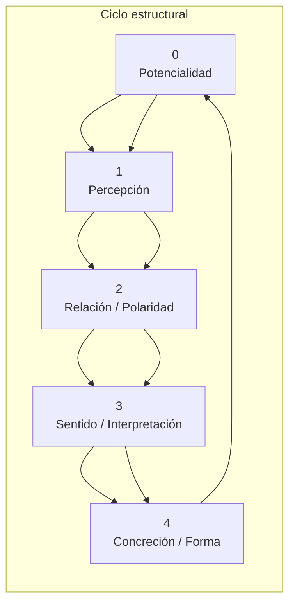

# 🧭 Diagrama estructural del modelo `01234`

Representación mínima del patrón 01234 como secuencia estructural de aparición, tensión, interpretación y concreción.

Este esquema representa el patrón de aparición interna de todo sistema cognitivo o experiencia significada.

- `0`: campo previo, no manifiesto
- `1`: distinción inicial, foco
- `2`: polaridad, alma, contraste
- `3`: interpretación, distorsión o sentido
- `4`: forma, manifestación

> El ciclo vuelve al `0` para reiniciar o reconfigurar lo manifestado.