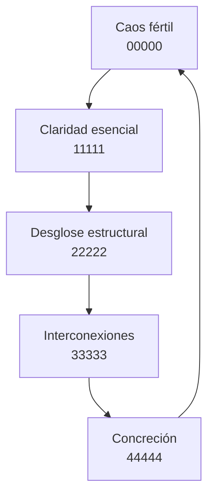

# 🧠 El Modelo 01234 aplicado a mi PKM

Este documento funciona como un mapa metacognitivo de mi sistema de gestión del conocimiento, alineado con la lógica estructural del modelo 01234. En lugar de adoptar un sistema externo, he construido uno vivo, funcional y coherente con mis principios.

---

## 🔲 Campo 0: Entrada / caos fértil
- Carpeta: `00000`
- Función: registrar ideas en bruto, sin necesidad de comprensión inmediata
- Acción clave: **Capturar**

## 🟦 Campo 1: Claridad esencial
- Carpeta: `11111`
- Función: formular definiciones, principios, distinciones fundamentales
- Acción clave: **Nombrar**

## 🟩 Campo 2: Desglose estructural
- Carpeta: `22222`
- Función: analizar, ramificar, descomponer ideas complejas
- Acción clave: **Analizar**

## 🟨 Campo 3: Interconexión semántica
- Carpeta: `33333`
- Función: mapear resonancias, correspondencias, relaciones entre ideas
- Acción clave: **Conectar**

## 🟥 Campo 4: Concreción creativa
- Carpeta: `44444`
- Función: plasmar en forma final, expresar públicamente, ejecutar
- Acción clave: **Manifestar**

---

## 🧭 Dinámica general

Este bucle cíclico refleja el flujo vivo de la atención, desde la percepción inicial hasta la acción materializada.

---

## 🔗 Índices
- [[0_index]]
- [[1_index]]
- [[2_index]]
- [[3_index]]
- [[4_index]]