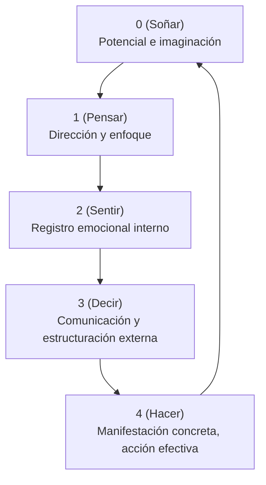

# Correlación del Metamodelo 01234 con: Soñar, Pensar, Sentir, Decir, Hacer

## 0 → Soñar

- Potencialidad pura y latente
- Estado previo a la manifestación consciente
- Espacio donde emergen visiones, intuiciones, imágenes y posibilidades futuras
- Lo que aún no tiene forma definida, pero contiene todas las formas posibles

## 1 → Pensar

- Identificación, enfoque, decisión inicial
- Organización cognitiva consciente
- Dar dirección y propósito a lo percibido en el estado latente
- Estructura inicial de significado: seleccionar y discernir

## 2 → Sentir

- Percepción dual, comparación y contraste interno
- Resonancia emocional, sensibilidad, registro en la memoria experiencial
- Evaluación subjetiva, autoconciencia reflexiva
- Puente entre la cognición pura y la emoción como experiencia corporal

## 3 → Decir

- Expresión, conexión y comunicación hacia el exterior
- Dar sentido a través del lenguaje y simbolización
- Contextualización, narración, interpretación de lo sentido y pensado
- Estructuración del significado compartido con otros

## 4 → Hacer

- Manifestación tangible, materialización de ideas en actos concretos
- Acción, resultado, experiencia directa en el mundo
- Cierre del ciclo desde la potencialidad hasta la realidad manifestada
- Consolidación y aprendizaje mediante la repetición y la experiencia física
